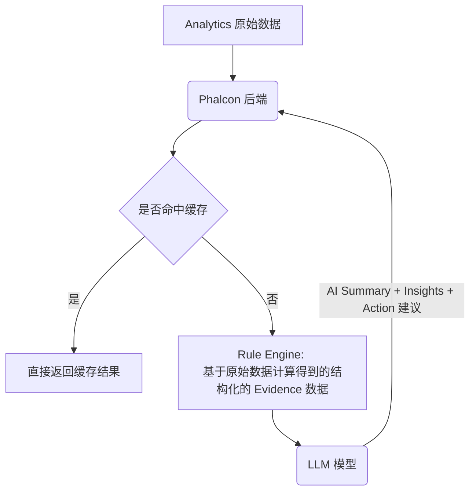

# \[20260224\] Analytics 模块优化

# 背景与目标

## 背景

当前 Analytics 模块主要提供基础统计展示（Alert 数量、风险等级分布、链分布等），但存在以下不足：

*   重点展示 Alert 数据，用户不关心
    
*   缺少周期对比能力，难以判断风险趋势
    
*   展示的数据指标和用户实际关心的内容不匹配
    

在实际使用中，用户更关心的是：

*   当前**整体风险水平**和扫描情况如何？
    
*   风险是否在**上升或下降**？
    
*   风险详情解读？
    
    *   风险规模及趋势
        
    *   风险结构
        
*   是否存在需要立刻采取行动的**异常情况**？
    

因此，需要对现有 Analytics 模块进行升级以展示用户更关心的数据并提供自定义的筛选、导出能力。

## 目标

本需求目标是在保持结构清晰与可扩展性的前提下，提升 Analytics  风险表达能力与趋势解读能力。

重点包括：

1.  强化风险维度
    
    *   增加风险比例、变化指标
        
    *   支持周期对比分析
        
    *   所有核心指标基于 target（地址 / 交易）维度计算，而非 alert
        
2.  提升数据解释能力
    
    *   引入 ++AI++ 解读功能，对关键变化进行自动总结
        
    *   输出风险趋势判断与潜在驱动因素
        
3.  明确模块定位
    
    *   本模块定位为风险分析与趋势洞察中心
        
    *   与 Home（操作入口）区分
        

AI 解读作为本模块的增强能力，主要用于：

*   自动总结周期内风险变化
    
*   识别显著趋势或异常波动
    
*   给出推荐的操作建议
    

# 方案

## 整体结构

页面自上而下展示顺序：

*   **Filter + Export**：支持以日期、target type 和链全局筛选；PDF、CSV、Excel 等多种格式下载
    
*   **AI Insights**：使用 AI 用文字形式总结重点数据和异常情况
    
*   **核心指标卡片**：关键的指标卡片形式展示
    
*   **Risk Overview**：风险规模、结构、分布和趋势
    
*   **Screen Overview**：筛查规模、分布和趋势
    

> 后续可以考虑增加 Customize 的功能，提供一系列数据卡片让用户自定义展示哪些数据卡片

原型：

[Figma  设计稿: https://www.figma.com/design/hsxEaRsCidIR2x3rh9XN3x/Phalcon?node-id=2625-6039&t=95j67TSiRYzMkDxi-4](https://www.figma.com/design/hsxEaRsCidIR2x3rh9XN3x/Phalcon?node-id=2625-6039&t=95j67TSiRYzMkDxi-4)

## Export

支持导出当前筛选视图的数据。

可下载格式：

*   PDF
    
*   Excel
    
*   CSV
    

文件名格式：phalcon-analytics-{start\_date}-{end\_date}.{ext}

Time Format: 不同导出格式采用不同时间格式。

*   Excel / CSV
    
    *   使用 ISO 8601 (UTC)：YYYY-MM-DDTHH:mm:ssZ
        
    *   示例：2026-03-05T14:32:00Z
        
*   PDF 使用 **Human-readable 格式**：
    
    *   Date Range: Feb 26 – Mar 5, 2026
        
    *   Date: Mar 5, 2026
        
    *   Generated Time: Mar 5, 2026 14:32 UTC
        

Number Format

*   Percentage 以小数形式展示
    

#### PDF

[《PDF 模板》](https://alidocs.dingtalk.com/api/doc/transit?dentryUuid=jb9Y4gmKWrqABrDoHQOL2zgL8GXn6lpz&queryString=utm_medium%3Ddingdoc_doc_plugin_card%26utm_source%3Ddingdoc_doc)

#### Excel 模板

[请至钉钉文档查看附件《Analytics\_Export\_Templates.xlsx》](https://alidocs.dingtalk.com/i/nodes/QOG9lyrgJPvE5n02cXy3zyrmWzN67Mw4?doc_type=wiki_doc&iframeQuery=anchorId%3DX02mmd7rm0w5lzz2gw0asr)

#### CSV 模板

[请至钉钉文档查看附件《Analytics\_CSV\_Templates.zip》](https://alidocs.dingtalk.com/i/nodes/QOG9lyrgJPvE5n02cXy3zyrmWzN67Mw4?doc_type=wiki_doc&iframeQuery=anchorId%3DX02mmd7y50b9smnxi4kb3u)

## Filters

#### Date Filters

展示快捷选项按钮和自定义日期选择框。

##### 快捷选项：

*   Last 24 hours
    
*   Last 7 days（默认）
    
*   Last 30 days
    
*   Last 90 days
    

| 选项 | 用法 |
| --- | --- |
| 24 Hours | rolling（精确到当前时间） |
| 7 Days | 自然日对齐 |
| 30 Days | 自然日对齐 |
| 90 Days | 自然日对齐 |

*   示例（当前时间：2026-04-13 14:30）
    
    *   24 Hours
        
        *   2026-04-12 14:30 ～ 2026-04-13 14:30
            
    *   7 Days
        
        *   2026-04-07 00:00:00 ～ 2026-04-13 23:59:59
            
    *   30 Days
        
        *   2026-03-15 00:00:00 ～ 2026-04-13 23:59:59
            

##### Custom Date

复用当前 Analytics 页面 Alert 部分的日期选择器。

规则：

*   必须同时选中起止日期
    
*   选中生效后，快捷选项失效
    

#### 数据对比 （Compare with previous period）

所有的数据都要加上和 previous period 的对比：

++previous period  = 当前选择周期前一个等长周期++

Note：

*   若 `previous_value > 0`，正常计算 change%
    

*   若 `previous_value = 0` 且 `current_value = 0`，change 显示为 `0%`
    

*   若 `previous_value = 0` 且 `current_value > 0`：
    

*   不计算百分比变化
    
*   UI 显示为 `New` 
    

若上一周期整体无活动（所有核心指标均为 0），则本期视为 **无可比基线**，页面中的 change 信息不展示。

即：

*   单个指标 previous=0 → 显示 New
    
*   整个上一周期全部为 0，不显示 Change
    

#### 其他 Filters

支持多选，可筛选项：

*   Target
    
    *   Address / Transaction
        
*   Chain
    
    *   所有支持的 Chain
        

## AI Insights

AI Insights 用于自动分析当前筛选条件下的 Analytics 数据，并生成：

*   风险变化总结
    
*   关键风险来源
    
*   潜在异常情况
    
*   推荐操作建议
    

帮助用户快速理解当前风险状况，而无需逐一阅读各个图表。AI Insights 的分析基于当前页面展示的数据。

AI 模块示例：

:::
 AI Insights

当前周期内，风险水平**整体保持稳定**。高风险及极高风险目标数量从前一周期的32个增至35个，增幅约9.4%。风险敞口的主要驱动因素为**诈骗相关活动**，其中诈骗导致的资金流入风险敞口达420,000美元，**占总流入的60%**。                          
:::

展开后：

:::
 AI Insights

当前周期内，风险水平**整体保持稳定**。高风险及极高风险目标数量从前一周期的32个增至35个，增幅约9.4%。风险敞口的主要驱动因素为**诈骗相关活动**，其中诈骗导致的资金流入风险敞口达420,000美元，**占总流入的60%**。

**诈骗**相关资金流入风险敞口达420,000美元，占当前周期流入交互风险的**60.0%**。  查看->

参与方风险中，**诈骗**指标占已识别目标的**35.2%**（25个唯一目标）。                        查看->

Mixer Interaction规则触发次数为45次，占当前周期所有规则触发的**37.5%**。          查看->

建议措施：针对诈骗风险敞口集中的资金流入交易实施强化审查。
:::

### 生成方案

当前方案的 AI Insights 生成流程如下：

*   先由后端根据确定的 Rule 生成结构化的 Evidence 数据，可以约束 LLM 的生成结果，同时可以节省 Token。
    
*   另一种方案：直接传原始数据给 LLM 总结，测试下来看结果不是很可控和理想。
    
*   如果 Rule  只命中了 “`no_significant_change`” 这个规则，不传给 LLM 模型，且不展示 AI Insights 模块
    

#### Rule Engine 和 Rule 定义

见文档：

[《AI\_INSIGHTS\_RULE\_ENGINE\_SPEC\_CN》](https://alidocs.dingtalk.com/api/doc/transit?dentryUuid=Qnp9zOoBVBBbarMdinyL4zdyV1DK0g6l&queryString=utm_medium%3Ddingdoc_doc_plugin_card%26utm_source%3Ddingdoc_doc)

#### Prompt 及请求相关流程

可参考脚本：

[请至钉钉文档查看附件《test\_openrouter.py》](https://alidocs.dingtalk.com/i/nodes/QOG9lyrgJPvE5n02cXy3zyrmWzN67Mw4?doc_type=wiki_doc&iframeQuery=anchorId%3DX02mnfmhr889zunpno7qt)

### 交互

经过测试发现结果生成时延比较高，交互时需要：

*   增加 Loading 状态
    
*   考虑流式输出
    

**用户反馈**

本模块还需要增加用户反馈按钮：\[👍 Helpful\] 和 \[👎 Not helpful\]，记录用户反馈，便于及时感知和优化

### Home 页引导展示 

**展示对象**

仅对 Starter Plan 及以上用户展示。

**功能目的**

在 Home 页增加 Analytics Insights 模块，用于展示当前风险概况的 AI 总结，使用户在进入平台时即可快速了解近期风险情况，同时引导用户进入 Analytics 模块查看完整数据分析。

**数据来源**

模块数据基于 **Analytics 页面默认筛选条件**生成，包括：

*   Date Filter：默认 **Last 7 days**
    
*   Target：All
    
*   Chain：All
    

系统按照上述默认条件生成 Analytics 数据，并调用 **AI Insights** 生成风险总结。

#### 展示内容

模块展示 AI Summary 的简要内容，用于快速提示当前风险情况，例如：

> High-risk activity increased by 18% over the past 7 days, primarily driven by Ethereum transaction exposure related to Mixing services.

模块右侧提供 “View Analytics” 按钮。用户点击后：

*   跳转至 Analytics 页面
    
*   自动应用 相同的默认筛选条件
    

若当前筛选条件下无 AI Insights 数据或生成失败则不展示该模块。

### 核心指标卡片

展示用户最关心的指标，以数字卡片 + 趋势对比形式呈现，使用户在进入页面后快速掌握风险整体情况，包含：

*   风险强度
    
*   风险规模
    

所有指标：

*   基于筛查对象（地址/交易）维度计算
    
*   显示与 previous period 的变化百分比
    
*   可显示 previous period 对应值
    

| 名称 | 定义 | 文案 |
| --- | --- | --- |
| High & Critical  Ratio | High / Critical 占比，用于展现风险强度 （第二个指标除以第三个指标） | **副标题（可选）** % of total targets **Tooltip** Percentage of addresses and transactions classified as High or Critical risk out of total unique targets screened during the selected period. |
| High & Critical Risk Targets | 当前周期内扫过的地址/交易中当前为 High / Critical Risk 的数量，用于展示风险规模 | **副标题（可选）** Severe risk exposure **Tooltip** Number of unique addresses and transactions whose latest risk level during the selected period is classified as High or Critical. |
| Total Targets Screened  （暂定，也可不展示） | 当前周期内筛查过的 unique 的地址和交易数量 | **副标题（可选）** Unique addresses & transactions **Tooltip** Number of unique targets (addresses and transactions) screened during the selected period. If a target was screened multiple times, it is counted once. |
| Total Screening Count | 所有扫描次数（包括重复 re-screen），用于掌握扫描次数规模，评估消耗。 | **副标题（可选）** Including all screening actions **Tooltip** Total number of screening actions performed during the selected period. |

### Risk Overview 

用于展示风险结构与趋势。

包含：

| 名称 | 类型和展示内容 | 示意图 |
| --- | --- | --- |
| **Risk Trend** | 类型：折线图 / 堆叠面积图 维度： *   X 轴：时间（按天/周/月，自动根据时间范围切换）          *   ≤ 1 天：按小时（Hour）              *   ≤ 31 天：按天（Day）              *   32–180 天：按周（Week）              *   ≥ 181 天：按月（Month）          *   Y 轴：unique target 数量      *   不同的折现展示不同风险等级的数量：No Risk / Low / Medium / High / Critical       （需要看一下各 Risk Level 对应的颜色可否调整，现在的有点丑） 统计口径（本模块统一用此口径） *   基于 unique target（地址/交易）      *    若同一 target 在周期内多次扫描：          *   仅统计一次              *   风险等级取该周期内最新结果          交互： *   点击某个时间 bucket（天/周/月）→ 带 `date_range=bucket` 跳转Targets 列表页（Address / Transaction）          *   若用户 filter 指定了 target type：直接跳对应列表页              *   若未指定：弹窗让用户选择 Addresses / Transactions          *   `chain_filter = current` | 可以考虑做一个联动的图，参考： [https://echarts.apache.org/examples/zh/editor.html?c=dataset-link](https://echarts.apache.org/examples/zh/editor.html?c=dataset-link) 说明： *   左侧展示折线图，右侧展示 Donut 图      *   Donut 图默认展示本周期总合数据的分布情况      *   用户 hover 到某具体日期点上时， Donut  图切换为展示对应日期的分布数据 |
| **Risk Level Distribution** | 类型：Donut 纬度： *   分类：Risk Level      *   数量：对应 Risk Level 的 Target 数量      对比方式： *   对比通过 Lengend 旁边数值展示，如：       Critical: 124, 1.3% (↑0.2%)      交互： *   点击某个 Risk Level -> 带 risk level 参数跳转Targets 列表页（Address / Transaction）          *   若用户 filter 指定了 target type：直接跳对应列表页              *   若未指定：弹窗让用户选择 Addresses / Transactions          *   `risk_level = selected level`      *   `date_range = current range`      *   `chain_filter = current` |
| **Top Triggered Rules** | 类型：柱状图 展示内容： *   规则名称      *   触发次数      对比方式： *   每个柱状图右侧显示与上周期的对比数据：`-4%` 或 `+25%`        交互： *   点击每个柱状图跳转到对应的规则详情页      限制展示 Top 10 其余合并为 Others。 |  1 |
| **Identity Exposure Distribution** Tooltip: Shows the distribution of risk indicators directly associated with screened targets. | 类型：Dount Chart 展示被扫描 targets 自身命中的 Risk Indicator 分布。 *   维度：Risk Indicator      *   指标：Count（unique targets）      对比方式： *   在 Legend 数字旁展示变化的百分比。 |  |
| **Risk Exposure Flow** Tooltip: Shows how screened targets receive and send funds across different risk indicators. Flow width represents the total risk exposure value. | 用于展示筛查对象（targets）与不同风险实体之间的资金流向结构，帮助用户理解风险资金的来源与去向。 类型：Sankey 图 节点： *   中心：Screened Targets      *   左侧节点：Inflow Risk Indicators， 每个节点代表一种 Risk Indicator，其他未识别出风险的资金统一归到 ‘Others’ 节点。      *   右侧节点： Outflow Risk Indicators，表示资金流向的风险类型，其他和左侧一致。      统计指标：Risk Exposure Value (USD) Total Inflow Value ≈ Total Outflow Value 图上展示文字如： Mixing $670K (+25%) |  |

### Screen Overview

用于解释风险背景与筛查行为。

包含：

| 名称 | 类型和展示内容 | 示意图 |
| --- | --- | --- |
| **Screened Transaction Volume (USD)** | 展示被筛查交易的金额规模变化趋势，帮助用户了解当前筛查交易的资金规模及其变化情况。 类型：面积图 维度： *   X 轴：时间           *   ≤ 1 天：按小时（Hour）              *   ≤ 31 天：按天（Day）              *   32–180 天：按周（Week）              *   ≥ 181 天：按月（Month）          *   Y 轴：Transaction Value (USD)      对比方式： *   上一周期数据展示为虚线       交互： *   点击某个时间 bucket 跳转 transaction 列表页，          *   `date_range = clicked bucket`              *   `chain_filter = current` |  |
| Screening Count Trend | 类型：折线图 维度： *   X 轴：时间          *   ≤ 1 天：按小时（Hour）              *   ≤ 31 天：按天（Day）              *   32–180 天：按周（Week）              *   ≥ 181 天：按月（Month）          *   Y 轴：Screen Count      *   折线：Screen Count 总数      对比方式： *   上一周期展示为虚线      交互： *   点击某个时间 bucket，跳转 target 列表页          *   若已指定 target type：直接跳              *   否则弹窗选择 Addresses / Transactions          *   `date_range = clicked bucket`      *   `chain_filter = current` |  |
| Screen 占比：API / Manual / System | 类型：Donut 展示内容： *   API / Manual / System 各自 Screen 次数      对比方式： *   通过 Lengend 旁边数值展示，如：       API: 1.3% (↑0.2%) |  |

Analytics 图表按图表类型采用不同统计口径：

1.  **趋势类图表**  
    按时间 bucket 去重统计。  
    同一 target 在同一个 bucket 内多次扫描仅计一次；若跨多个 bucket 出现，可在各 bucket 中分别统计。风险等级取该 bucket 内最新结果。
    
2.  **总量分布类图表**  
    按所选周期整体去重统计。  
    同一 target 在周期内多次扫描仅计一次，风险等级取该周期内最新结果。previous period 按相同规则独立计算。
    
3.  **规则类图表**  
    按 rule + target 去重统计。  
    同一 target 在所选周期内重复命中同一规则，仅计一次。用于反映该规则影响的 unique targets 数量。
    

# 其他思考

还有什么别的维度的数据可以展示？

#### 1️⃣ Exposure 维度（金额暴露）

在现有风险数量统计基础上，增加金额视角：

*   High & Critical Exposure (USD)
    
*   High-risk Exposure Ratio (USD)
    
*   Total Value Screened (USD)
    
*   Exposure by Direction（Deposit / Withdrawal）
    
*   High-risk Exposure by Category（Risk Indicator）
    

#### 2️⃣ KYT （交易）纬度 （可以放在 Screen 纬度）

*   交易时间分布
    
*   扫描的交易金额趋势等
    

从整体来看，如果要加上 Exposure 纬度和 KYT 纬度的数据，是否也需要加上 Behavior 和 KYA 纬度的数据整体结构上才会合理？

#### 3️⃣ Screening & 用量异常 （Screen Overview 部分已有）

结合计费与运营视角：

*   Screening 数量异常波动提醒
    
*   重复 re-screen 比例
    

#### 4️⃣ 后续结合 Case Management

区分角色权限展示不同内容

*   High-risk → Case → Closed 转化结构
    
*   SLA 达标率
    
*   平均处置时间
    

## Archived

| Insight 类型 | 触发条件 | 模板 |
| --- | --- | --- |
| Address Risk Spike | *   单日 High & Critical Addresses > period\_avg × 1.5      *   且 单日值 ≥ 8 | ⚠ Address Risk Spike On {date}, {value} high-risk addresses were identified, significantly above the period average of {avg\_value}. |
| Transaction Risk Spike | *   单日 High & Critical Transaction > period\_avg × 1.5      *   且 单日值 ≥ 8 | ⚠ Transaction Risk Spike On {date}, {value} high-risk transactions were identified, significantly above the period average of {avg\_value}. |
| Address Risk Trend Insight | *   需 Compare 开启      满足任一： *   High & Critical Risk Addresses 数量变化 ≥ ±20%      *   地址风险比例变化 ≥ ±10%      且： *   current\_value >= 10      *   previous\_value >= 10 | 增长： 📈 Address Risk Increased   High & Critical risk addresses increased by {change\_pct}%, rising from {prev\_value} to {current\_value}. 下降： 📉 Address Risk Decreased   High & Critical risk addresses decreased by {change\_pct}%, dropping from {prev\_value} to {current\_value}. |
| Transaction Risk Trend Insight | *   High & Critical Risk Transactions 变化 ≥ ±20%      *   交易风险比例变化 ≥ ±10%      且： *   current\_value ≥ 10      *   previous\_value ≥ 10 | 增长： 📈 Transaction Risk Increased   High & Critical risk transactions increased by {change\_pct}%, rising from {prev\_value} to {current\_value}. 下降： 📈 Transaction Risk Increased   High & Critical risk transactions decreased by {change\_pct}%, rising from {prev\_value} to {current\_value}. |
| Rule Trigger Surge | *   环比增长 ≥ +50%      *   且 current\_count ≥ 20      或 *   占比 ≥ 30%      *   且 current\_count ≥ 30 | 模板（增长） 📌 {TargetType} Rule Trigger Surge   Rule “{rule\_name}” was triggered {count} times for {target\_type} this period, up {change\_pct}% from the previous period. 模板（占比型） 📌 {TargetType} Rule Concentration   Rule “{rule\_name}” accounts for {percentage}% of all rule triggers for {target\_type} in this period. *   `{target_type}` 取值：addresses / transactions |
| Chain Risk Concentration | *   某链 High & Critical Addresses 占比 ≥ 40%      *   或某链交易风险占比 ≥ 40% | ### 模板 🔗 Address Risk Concentrated on {chain}   {chain} accounts for {percentage}% of all high-risk addresses during this period. 或 🔗 Transaction Risk Concentrated on {chain} |
| Screening Surge | *   Screening Count 环比 ≥ +50%      *   且 unique targets 变化 ≤ ±10%      *   且 current\_screening ≥ 100 | 🔄 Screening Activity Increased Screening actions increased by {change\_pct}% compared to the previous period, while the number of unique targets remained relatively stable. |